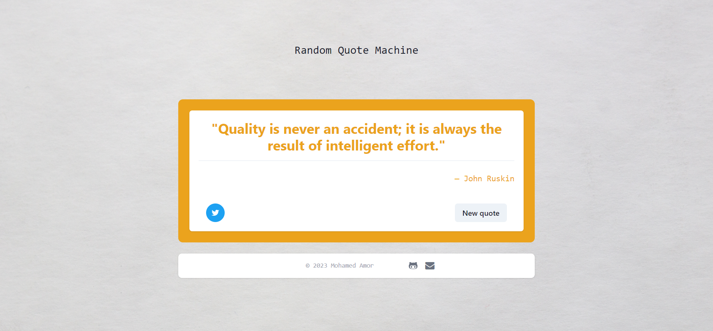

# Random Machine Quote Generator

This is a simple React project that generates random quotes and changes the color using two APIs. It's a fun way to get inspired or just add some randomness to your day.

## Technologies Used

- React
- JavaScript
- Chakra UI
- Tailwind CSS

## APIs Used

1. [Random Quote API](https://api.quotable.io/quotes/random)

   - This API provides random quotes to display in the application.

2. [Random Color API](https://x-colors.yurace.pro/api/random)
   - This API fetches random colors to update the background of the application.

## Features

- **Generate Random Quote:** Click the "New quote" button to get a random quote and change the background color.
- **Tweet Quote:** Share the quote and author on Twitter by clicking the "Tweet" Icon.

## How to Use

You can check this app on [Netlify](https://64eccc3c21896e3350b829ea--magenta-crostata-58fa00.netlify.app/)

Contributions are welcome! If you'd like to add new features, fix bugs, or improve the project in any way, please open an issue or create a pull request.

## License

This project is licensed under the MIT License - see the [LICENSE](LICENSE) file for details.

---

Enjoy the randomness and have fun with your daily dose of inspiration!
